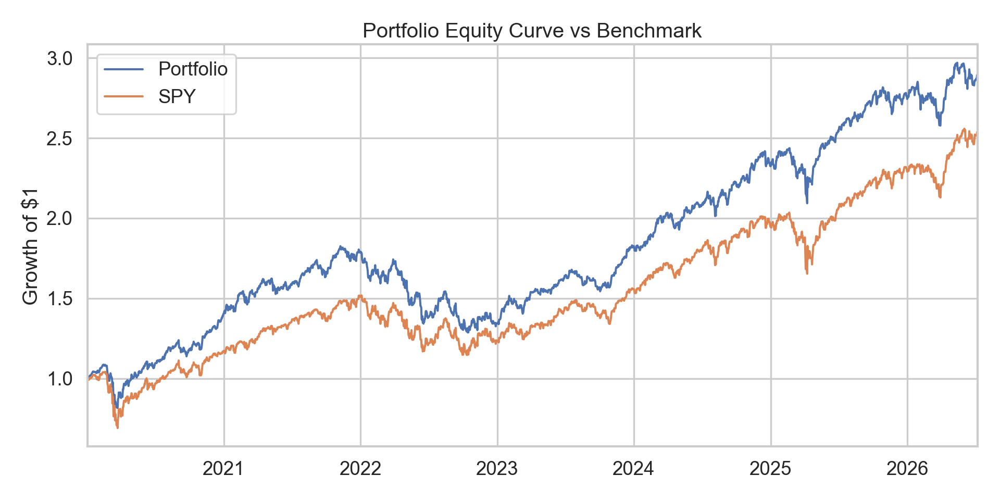
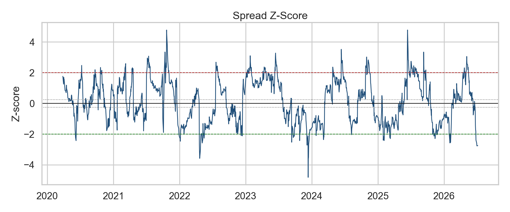
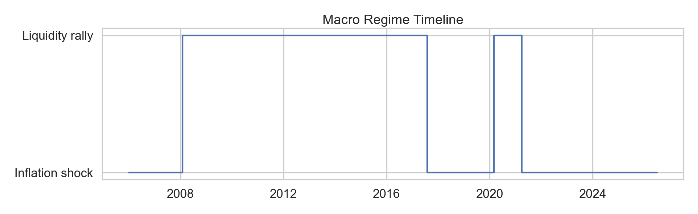
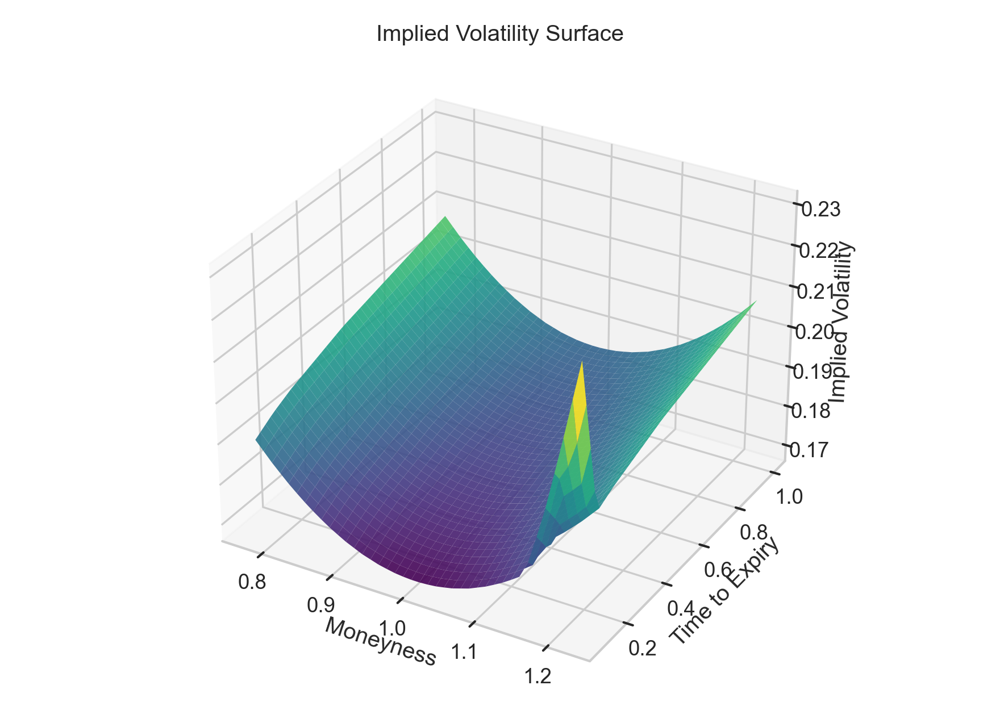
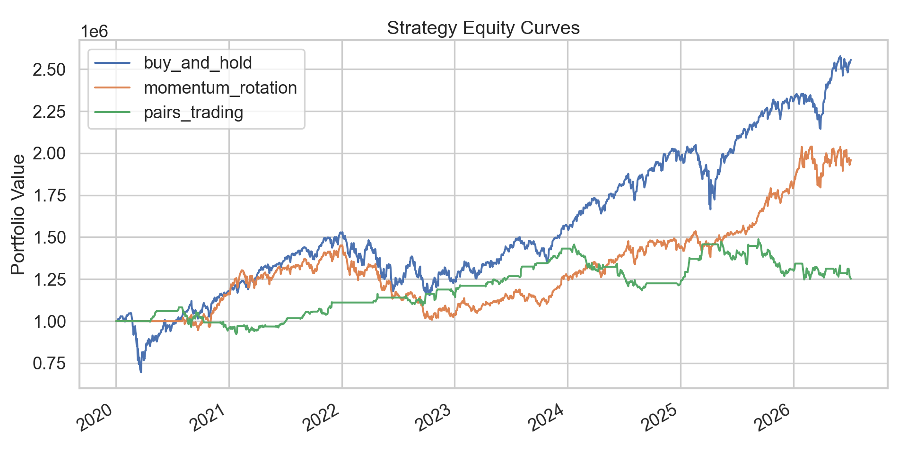

# Example Outputs

The repository tracks a small set of example images under `docs/assets/` so reviewers can see the type of output produced without running every script.

## Portfolio Risk

## Statistical Arbitrage

## Macro Regimes

## Volatility Surface

## Backtesting

